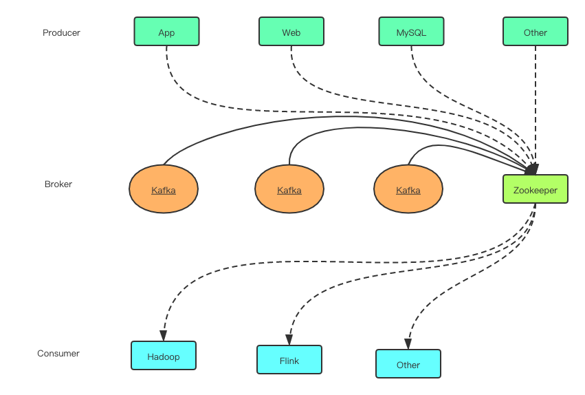
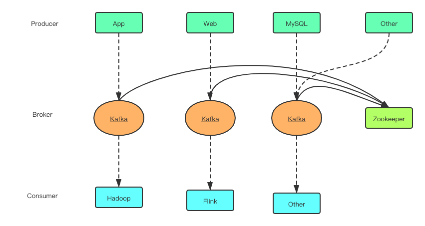

# 消息队列

## Kafka设计理念

- **低延迟**

  已时间复杂度为O(1)的方式提供消息处理能力，即使对TB级以上的数据也能保证常数时间复杂度的访问性能

- **高吞吐**

  即使在非常廉价的商用机器上也能做到单机支持每秒十万条以上消息的传输

- **水平扩展**

  支持Kafka Broker间的消息分区，以及分布式消费，同时支持在线水平扩展

- **顺序性**

  保证每个Partition内的消息顺序传输

- **多场景**

  同时支持离线数据处理和实时数据处理

## Kafka架构

Broker作为Producer和Consumer的中间人可以看成是Kafka的server，接收Producer的消息放入本地磁盘

Broker依赖于Zookeeper --> 元数据存储&领导全局

**因为Zookeeper写性能不太好，所以后续减少了对Zookeeper的依赖，Producer和Consumer不经过Zookeeper直连Broker**

## Topic & Partition & Segment

Record：每条消息就是一个Record

- Key-Value
- timestamp（时间戳用于流式处理）

Topic

- 逻辑概念（一个Topic相当于一个消息类别）
- 发布-订阅基于Topic

Partition

- 一个Topic包含一个或多个Partition
- 每个Partition物理上对应一个文件夹

Segment

- 一个Partition不是一个文件，而是一个文件夹，每一个文件夹就是一个Segment
- 删除旧数据就是直接删除最老的Segment（删除文件比删除文件里面的部分数据快很多）

## Producer

**Producer发送消息——同步&异步**

本地缓存队列，默认异步发送，需要同步发送使用flush()方法

**Producer如何保证消息的顺序性——Queue与Retry机制**

max.in.flight.requests.pre.connection设置1，表示一个producter和broker同一时间只能有一个消息发送

**消息路由策略——Partitioner**（可自定义）

如果没有Key就是轮流发送Partition（负载均衡，但是一类数据不是在同一个Partition）

有Key的话就是获取哈希值并modPartition数量（能保证Key值相同的数据在同一个Partition）

## Consumer API

### Low level API / Assign

- 指定目标Partition
- 指定消费的起始Offset
- 指定每次消费的消息长度
- 可只消费某Topic内的特定Partition的特定消息

### High level API / SUbscribe

- 每个Consumer实例属于特定的Consumer Group
- 默认情况下、Consumer Group会顺序消费某Topic的所有消息
- Offset存于Zookeeper或Kafka或自定义存储
- 实现了Rebalance机制

# Kafka Stream

- 流式计算：输入是持续的，一般先定义目标计算，然后数据到来之后将计算逻辑应用于数据，往往用增量计算代替全量计算。
- 批量计算：一般先有全量数据集，然后定义计算逻辑，并将计算应用于全量数据。特点是全量计算，并且计算结果一次性全量输出。

## Kafka Stream意义

开源流式处理系统有：Spark Streaming和Apache Storm，它们能与SQL处理集成等优点，功能强大

1、使用方便。Spark和Storm都是流式处理**框架**，而Kafka Stream是基于Kafka的流式处理**类库**。开发者很难了解框架的具体运行方式，调试成本高，使用受限。而类库直接提供具体的类给开发者使用，整个应用的运行方式主要由开发者控制，方便使用和调试。

2、使用成本低。就流式处理系统而言，基本都支持Kafka作为数据源。Kafka基本上是主流的流式处理系统的标准数据源。大部分流式系统中都部署了Kafka，包括Spark和Storm，此时使用Kafka Stream的成本非常低。

3、省资源。使用Storm或Spark Streaming时，需要为框架本身的进程预留资源，框架本身也占资源。

4、Kafka本身也有优点。由于Kafka Consumer Rebalance机制，Kafka Stream可以在线动态调整并发度。

## KTable和KStream

- KStream是一个数据流，可以认为所有的记录都通过Insert only的方式插入进这个数据流中。
- KTable代表一个完整的数据集，可以理解为数据库中的表。每条记录都是KV键值对，key可以理解为数据库中的主键，是唯一的，而value代表一条记录。我们可以认为KTable中的数据时通过Update only的方式进入的。如果是相同的key，会覆盖掉原来的那条记录。
- 综上来说，KStream是数据流，来多少数据就插入多少数据，是Insert only；KTable是数据集，相同key只允许保留最新的记录，也就是Update only

## 时间

Kafka支持三种时间：

- 事件发生时间：事件发生的时间，包含在数据记录中。发生时间由Producer在构造ProducerRecord时指定。并且需要Broker或者Topic将message.timestamp.type设置为CreateTime（默认值）才能生效。
- 消息接收时间：也即消息存入Broker的时间。当Broker或Topic将message.timestamp.type设置为LogAppendTime时生效。此时Broker会在接收到消息后，存入磁盘前，将其timestamp属性值设置为当前机器时间。一般消息接收时间比较接近于事件发生时间，部分场景下可代替事件发生时间。
- 消息处理时间。也即Kafka Stream处理消息时的时间。

## 窗口

流式数据在时间上无界的，但是聚合操作只能作用在特定(有界)的数据集，这时候就有了窗口的概念，在时间无界的数据流中定义一个边界来用于计算。

- 1）Hopping Time Window：举一个典型的应用场景，每隔5秒钟输出一次过去1个小时内网站的PV或者UV。里面有两个时间1小时和5秒钟，1小时指定了窗口的大小(Window size)，5秒钟定义输出的时间间隔(Advance interval)。
- 2）Tumbling Time Window：可以认为是Hopping Time Window的一种特例，窗口大小=输出时间间隔，它的特点是各个Window之间完全不相交。
- 3）Sliding Window该窗口只用于2个KStream进行Join计算时。该窗口的大小定义了Join两侧KStream的数据记录被认为在同一个窗口的最大时间差。假设该窗口的大小为5秒，则参与Join的2个KStream中，记录时间差小于5的记录被认为在同一个窗口中，可以进行Join计算。
- 4）Session Window该窗口用于对Key做Group后的聚合操作中。它需要对Key做分组，然后对组内的数据根据业务需求定义一个窗口的起始点和结束点。一个典型的案例是，希望通过Session Window计算某个用户访问网站的时间。对于一个特定的用户（用Key表示）而言，当发生登录操作时，该用户（Key）的窗口即开始，当发生退出操作或者超时时，该用户（Key）的窗口即结束。窗口结束时，可计算该用户的访问时间或者点击次数等。